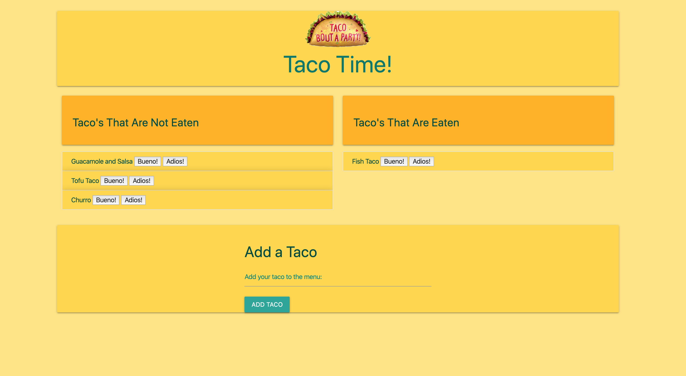

# Eat-Da-Taco-
A Taco Eating Application With Node.js/Express/MySQL/Handlebars

heroku: [https://floating-fortress-23538.herokuapp.com](https://floating-fortress-23538.herokuapp.com).

# Tools

This app uses Handlebars, MySQL, Node, Express, and a homemade ORM to create a taco logger. I followed the MVC design pattern and Node to Query the route data for the app. Handlebars was used to generate all of my HTML.

## Instructions
1. Type a taco name into the app and add it.
    - Taco will be added to the "Tacos Available to Eat" section of the page.
2. Select a taco you would like to **Devour** from the "Tacos Available to Eat List".
    - Taco will be moved to the "Tacos That Have Been Devoured" section of the page.

